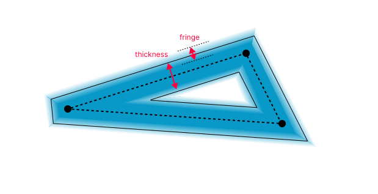
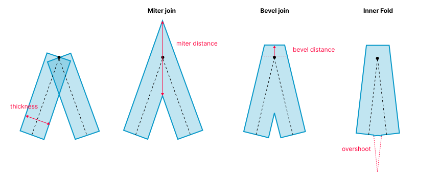
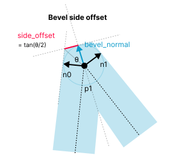
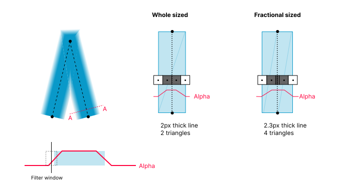
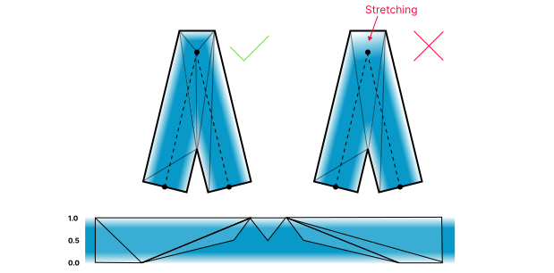
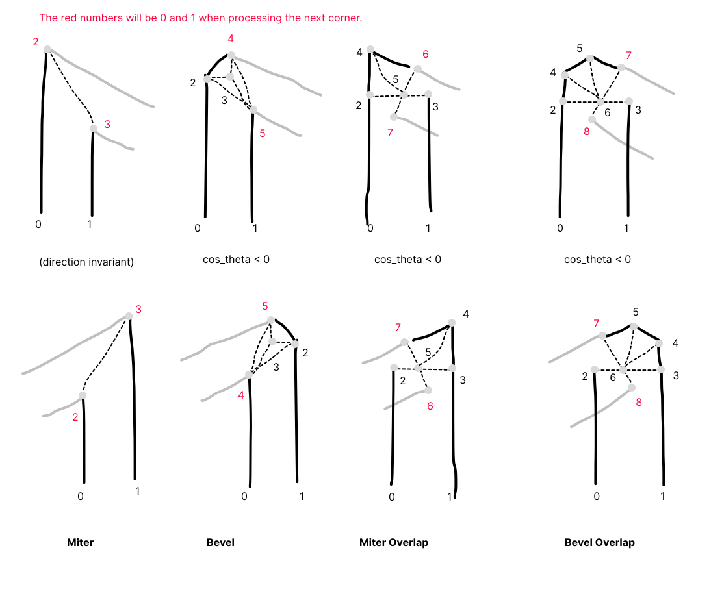
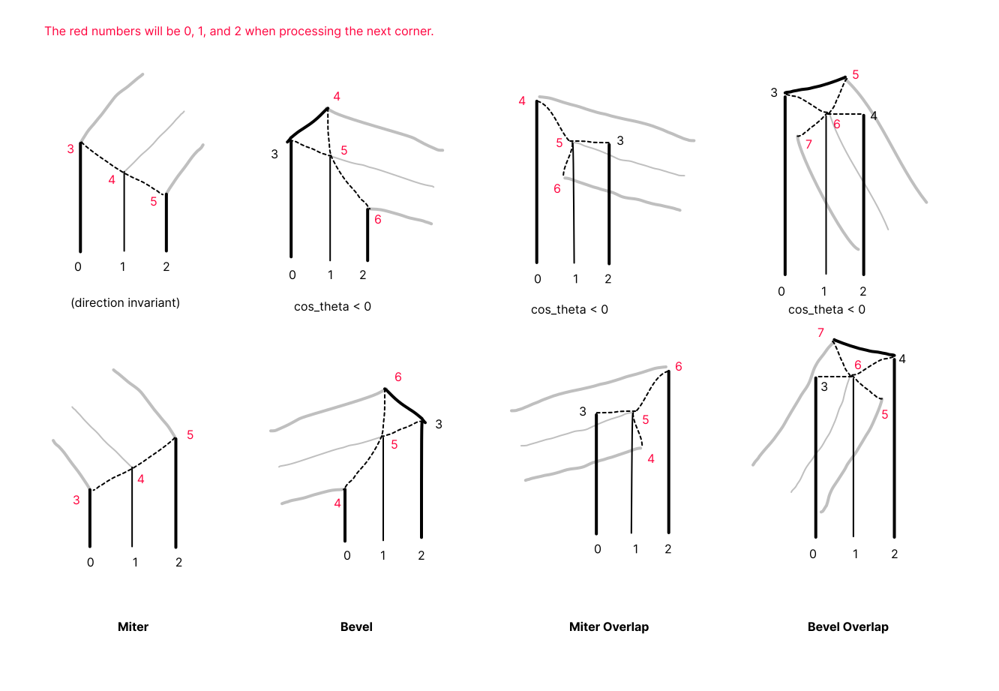

# Anti-aliased Polyline Rendering

The anti-aliased polyline rendering is based on expanding the stroke of the polyline, and making it slightly blurry by creating a fringe around the perimeter.

The fringe approximates box filtering of the line geometry. That is, you can get anti-aliased result by taking multiple samples (e.g. MSAA), analytically, or prefiltering the line and then taking just one sample. For more information, see "Prefiltered Antialiased Lines Using Half-Plane Distance Functions"
https://bitsavers.trailing-edge.com/pdf/dec/tech_reports/WRL-98-2.pdf

Rest of the document focuses in how we can efficiently and robustly generate the outline and fringe geometry.

## Corner Types

The stroke is expanded around the polyline along the normal of the lines. To create the continuous line, the corners are mitered or beveled depending how sharp the corner is.

The miter distance and direction can be calculated quite neatly from the normals of the neighboring segments. You can find detailed derivation here: https://www.angusj.com/clipper2/Docs/Trigonometry.htm

**Miter join** is the cheapest join, since it requires to only offset two points in opposite directions. The join can be used for most corners. With default miter limit of 4.0, miters will generally be used up to 150 degree corners.

**Belvel join** is a bit more complicated, and is used when the corners become very sharp. The sharper the turn, the more towards infinity the miter off set will shoot. Bevel is used to prevent the super spiky corners.

 There are several ways to do create the bevel. The simplest way is to just offset the bevel corners along the normals, but that creates a corner that is very hard to anti-alias with the method that is explained later. 
 
Instead, we are place the bevel points half stroke thickness away from the corner. It is a bit more expensive than the simple method, but allows us to control the texture coordinates used for texture based anti-aliasing. The bevel is essentially double miter, but we calculate it based on *side offset* which allows to easily reuse the distance on each side of the bevel.

 ## Fringes

 The fringes that describe the pre-filtered shape can be created any means necessary, as long as the pixels at the outer edge have transparency of 0, and the pixels close to the center have have the stroke color.

 Since the fringe represents filtered results, the start of the fringe is placed from half filter width outside the stroke edge to half filter width inside. For this reason we never let the line width to be smaller than twice the filter width, and instead just adjust the opacity of the lines smaller than filter width. This is still an approximation (we're dealing with square filter after all), but works and is in the right spirit. We use filter width (which is the fringe width) or 1 pixel.

### Fringe geometry

 One option is to just add extra column of triangles each side of the line, and adjust the colors of the outer vertices. This would mean that in order to render a thick line, we would need 3 columns of triangles. Instead we use textures to describe the fringe, which allows us to use just one column of triangles for thickness of integer sizes, or two rows for strokes that have fractional thickness.

The basic idea is that we create textures that have just transparent and opaque pixels, and let the GPU bilinear filter to do the fringe. This can save a lot of small triangles.

Since it's important to keep the fringe width constant, we cannot use that trick when the line width is not a whole number. In that case, we create a seam in the middle, which allows us to position the UV coordinates to maintain correct fringe width.

If we wanted to keep the code size and triangle count small, it is possible to create the fringe texture so that it can handle finite number of fractional sizes too. If 1 fringe pixel, 2 opaque, and 1 fringe is 2px line, then (1, 2.5, 1) x 2, that is 2,5,2 is 2.5px line. That is we can double the texture width to get a fraction more resolution. The idea is same as with font oversampling.

Bevel joins are a bit tricky to texture, so that we keep the fringe width consistent. The general idea is to try to avoid texture stretching (even if we use 1D texture). It's a bit of balance between triangle count, vertex placement, and complexity of calculations.

It can help to think how the shape would unfold to reason if the texture would stretch. Many of the issues can be solved by placing a vertex at the middle of the corner. This is also why we chose the specific corner geometry. When we place the vertex at the corner, the distance to the bevel edge will be haf thickness, which makes it trivial to place the texture coordinate at the middle too.

## Tessellation

As mentioned earlier we have two variations of the outline generation, depending on the texture coordinates. Bulk of the polyline code is how the corner vertices are placed, and how the triangles are placed. Unfortunately it is manual work.

Below are corners for the two variations. Note that the overlap corners for the "thin" variant creates a T vertex (which should be ok), if that causes problems, then 1 extra triangle needs to be added at along the seam.

The vertices are organized so that the last 2 (or 3) vertices becomes the 0,1 or 0,1,2 for the next corner (base_idx in the code).

### Thin tessellation

### Thick tessellation

The variants are called "thin" and "thick", since the code was inherited from a version which had the lines specialized based on 1px vs thick lines.